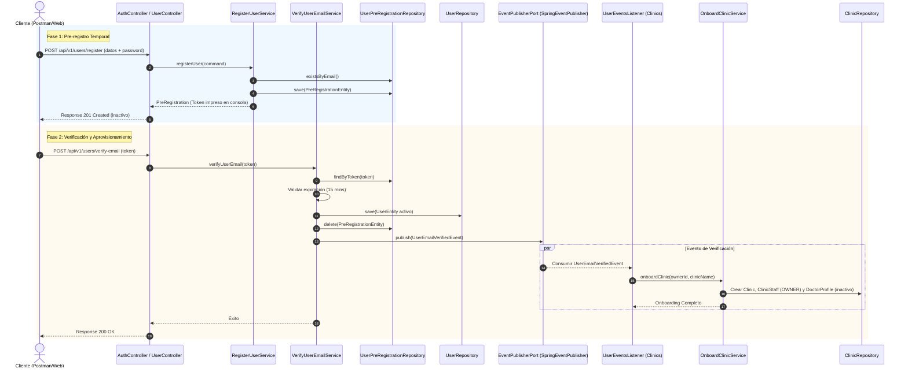
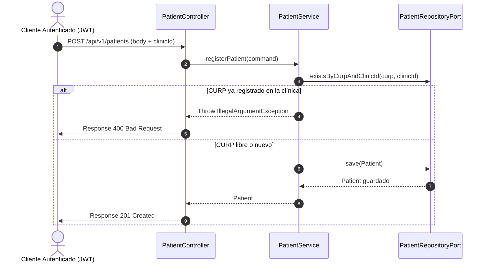
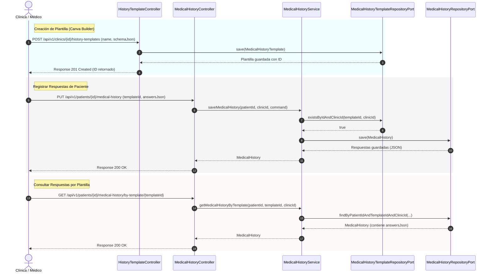
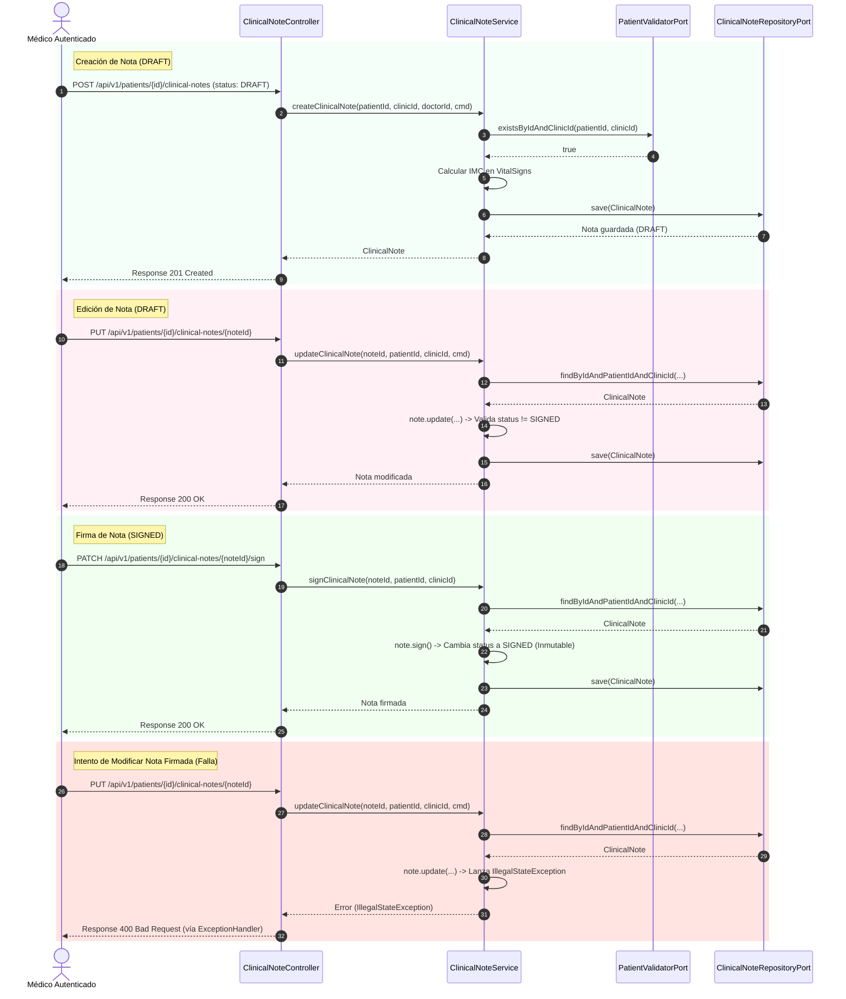

# Diagramas de Secuencia - Medicloud

Este documento visualiza mediante diagramas de secuencia (sintaxis Mermaid) los flujos lógicos clave implementados en el sistema hasta el momento.

---

## 1. Pre-registro, Verificación de Email y Onboarding de Clínica

Este diagrama describe cómo un usuario realiza su registro inicial en una tabla temporal, verifica su correo a los 15 minutos, y cómo el sistema aprovisiona automáticamente su clínica y perfil médico de forma reactiva a través de eventos.

---

## 2. Creación de Pacientes con Aislamiento Multi-Tenant

Representa cómo se registra un paciente y cómo se restringe la existencia de CURPs duplicados únicamente dentro de la misma clínica/consultorio para mantener el aislamiento multi-tenant.

---

## 3. Plantillas e Historias Clínicas Dinámicas (Arrastrar y Soltar)

Describe el flujo en el que la clínica define plantillas personalizadas (cuyo esquema en formato JSON es compatible con el editor visual tipo Canva) y cómo estas plantillas se consumen para guardar y consultar las respuestas del paciente.

---

## 4. Ciclo de Vida de Notas Clínicas (Formato SOAP)

Describe la creación de una nota clínica en estado Borrador (`DRAFT`), su edición, la firma electrónica (`SIGNED`) que la vuelve inmutable, y el rechazo automático del sistema ante cualquier intento de alteración posterior para dar cumplimiento a normativas sanitarias.

